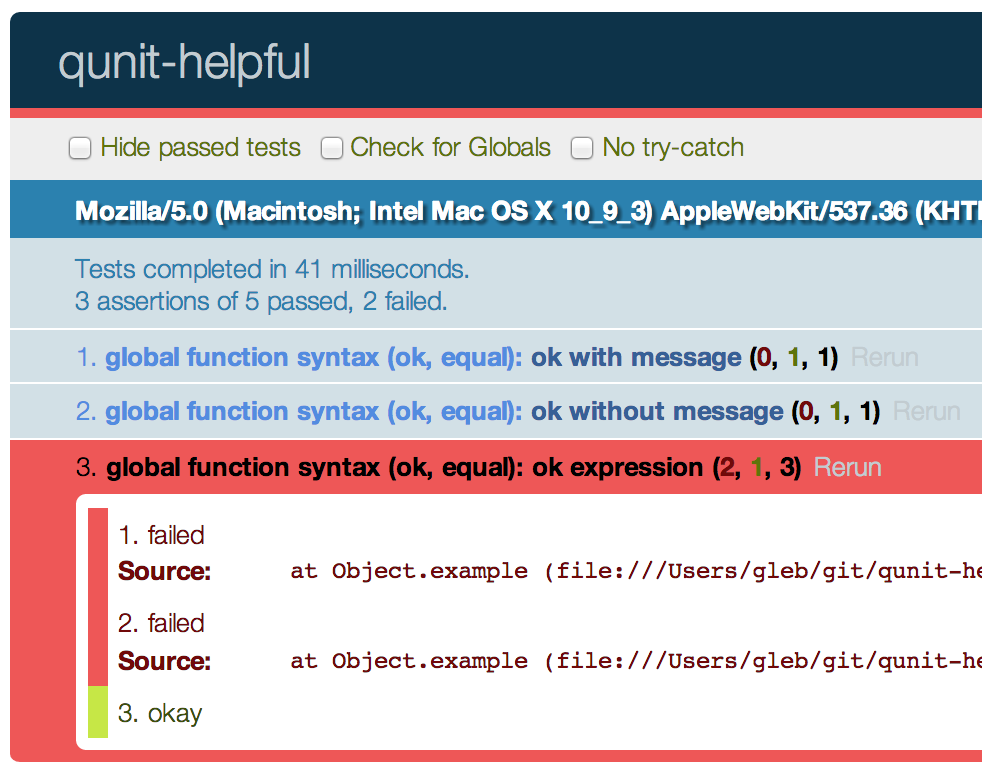
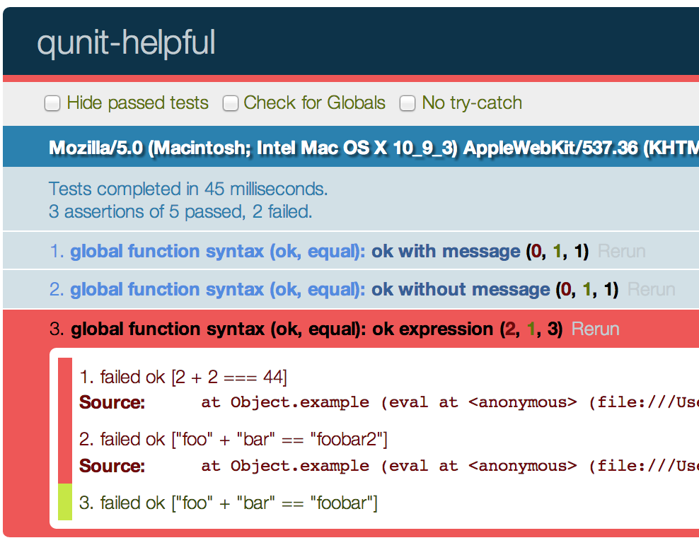

# qunit-helpful

> QUnit plugin to automatically show helpful info for failed assertions

[Test page](http://glebbahmutov.com/qunit-helpful/),
[tests with variable injection](http://glebbahmutov.com/qunit-helpful/index-with-inject.html)

[![NPM][qunit-helpful-icon]][qunit-helpful-url]

[![Build status][qunit-helpful-ci-image]][qunit-helpful-ci-url]
[![dependencies][qunit-helpful-dependencies-image]][qunit-helpful-dependencies-url]
[![devdependencies][qunit-helpful-devdependencies-image]][qunit-helpful-devdependencies-url]

[![endorse][endorse-image]][endorse-url]

## Example:

```js
// QUnit test with failing assertion
QUnit.test('simple test', function () {
  ok(2 + 2 === 5);
});

// output
  Errors:
    Module: global Test: simple test

// load qunit-helpful.js before tests, same test
// output
  Errors: ok [2 + 2 === 5]
    Module: global Test: simple test
```

Comparison screenshots with the failed assertions for source

```js
QUnit.test('ok expression', function () {
  ok(2 + 2 === 44); // fails
  ok('foo' + 'bar' == 'foobar2'); // fails
  ok("foo" + "bar" == 'foobar');
});
```

### QUnit with failed ok(expression)



### QUnit + qunit-helpful with failed ok(expression)



## Supported assertions

This package rewrites `ok, QUnit.ok, equal, QUnit.equal` assertions, leaving the rest of the
code unchanged. I might add other [QUnit assertions](http://api.qunitjs.com/category/assert/)
if needed.

## Explanation

QUnit (Jasmine, Mocha, etc) first evaluates the arguments, then passes the computed
values to assertion functions. Thus the failed assertion has no idea what the failing expression was.
This forces you to write assertion messages, repeating the test condition

```js
QUnit.ok(2 + 2 === 4, '2 + 2 === 4');
QUnit.equal(foo('a', 1), 'foo-a-1', 'calling foo with "a" and 1 produces "foo-a-1"');
```

*qunit-helpful* automatically rewrites your tests before QUnit executes them,
adding the condition *source* to the message string. Thus you can skip writing the
same stuff

```js
QUnit.ok(2 + 2 === 4);
// will be evaluated by QUnit as
// QUnit.ok(2 + 2 === 4, 'ok 2 + 2 === 4');
QUnit.equal(foo('a', 1), 'foo-a-1');
// will be evaluated by QUnit as
// QUnit.equal(foo('a', 1), 'foo-a-1', 'equal "foo('a', 1)" and "foo-a-1"');
```

Unknown or custom assertions will be left unchanged. The source rewriting is done
using [falafel](https://www.npmjs.org/package/falafel).

## Install

Node:

```
npm install qunit-helpful --save-dev
// load qunit-helpful before unit tests
$ qunit -c node_modules/qunit-helpful/qunit-helpful.js -t tests.js
```

Browser:

```
bower install qunit-helpful
// include the qunit js script first, then
<script src="bower_components/qunit-helpful/qunit-helpful-browser.js"></script>
// then include user tests
```

## Limitations

* `assert` argument to the unit test is not supported yet, please use `QUnit.equal` rather than
`function (assert) { assert.equal(...); }`

* global variables should be ok, but closure variables to the unit test will cause ReferenceError.
This is due to the dynamic source code rewriting and evaluation which leads to the test to have
a different lexical scope location.

```js
// will cause ReferenceError
var foo = 'foo';
QUnit.test('check foo', function () {
  QUnit.equal(foo, 'foo');
});
```

### Workaround 1

Skip dynamic test rewriting in this case by adding suffix `noHelp` or `no_help` to the test
function name

```js
var foo = 'foo';
QUnit.test('check foo', function checkFooNoHelp() {
  QUnit.equal(foo, 'foo');
});
```

### Workaround 2

If you need external non-global variables, use [qunit-inject](https://github.com/bahmutov/qunit-inject)
to inject them. Load *qunit-inject* before *qunit-helpful* and it should work.

```js
QUnit.module('injection', {
  foo: 'foo'
});
QUnit.test('check foo', function (foo) {
  QUnit.equal(foo, 'foo');
});
```

## Related

Other QUnit plugins I wrote:

* [qunit-once](https://github.com/bahmutov/qunit-once)
* [qunit-promises](https://github.com/bahmutov/qunit-promises)
* [qunit-inject](https://github.com/bahmutov/qunit-inject)

There is a different approach to improving assertion messages: grab the
[detailed callsite](https://github.com/visionmedia/callsite) as
[better-assert](https://www.npmjs.org/package/better-assert) does. Unfortunately,
this is limited to V8 javascript engine only. My approach should work with almost
any modern javascript engine (as long as it supports correct function `toString` method).

## Small print

Author: Gleb Bahmutov &copy; 2014 @bahmutov

License: MIT - do anything with the code, but don't blame me if it does not work.

Support: if you find any problems with this module, email / tweet / open issue on Github

[qunit-helpful-icon]: https://nodei.co/npm/qunit-helpful.png?downloads=true
[qunit-helpful-url]: https://npmjs.org/package/qunit-helpful
[qunit-helpful-ci-image]: https://travis-ci.org/bahmutov/qunit-helpful.png?branch=master
[qunit-helpful-ci-url]: https://travis-ci.org/bahmutov/qunit-helpful
[qunit-helpful-dependencies-image]: https://david-dm.org/bahmutov/qunit-helpful.png
[qunit-helpful-dependencies-url]: https://david-dm.org/bahmutov/qunit-helpful
[qunit-helpful-devdependencies-image]: https://david-dm.org/bahmutov/qunit-helpful/dev-status.png
[qunit-helpful-devdependencies-url]: https://david-dm.org/bahmutov/qunit-helpful#info=devDependencies
[endorse-image]: https://api.coderwall.com/bahmutov/endorsecount.png
[endorse-url]: https://coderwall.com/bahmutov
